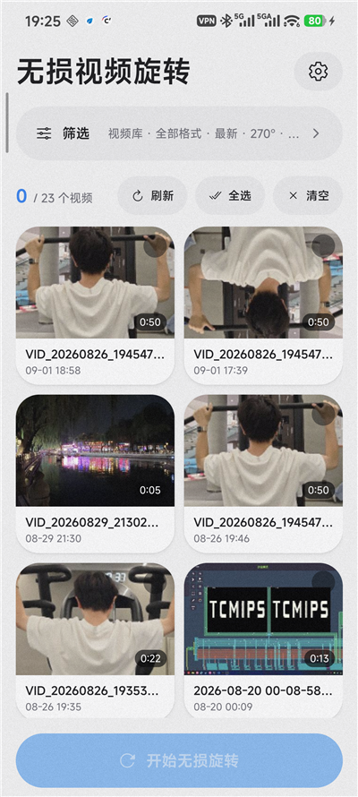
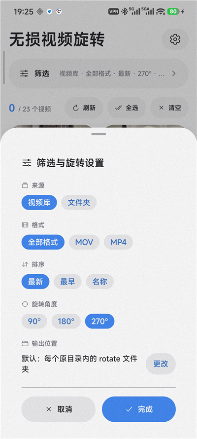
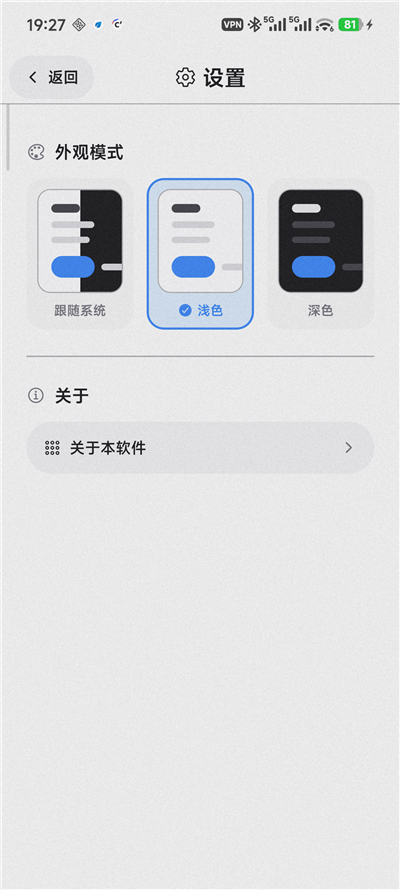
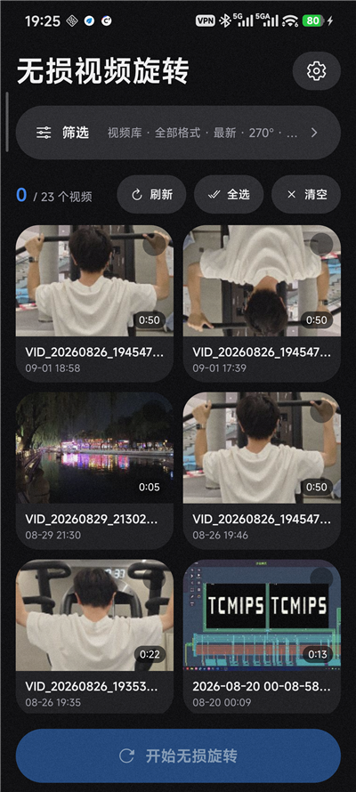

# 无损视频旋转

> 主打无损视频旋转，拯救 NIKON 用户。

一款面向 Android 的本地视频方向修正工具，主要解决尼康相机竖屏拍摄后，导出的 MOV 视频仍被横向播放的问题。应用只修改 MOV/MP4 视频轨道的标准显示矩阵，不解码、不重新编码、不重采样，因此处理速度快，画质与原始媒体码流保持不变。

V 2.0 起界面使用 **React Native + HeroUI Native** 重写，核心旋转引擎沿用经过字节级验证的 Kotlin 无损处理逻辑。

[下载最新版本](https://github.com/LiyuTian-web/Video_rotate/releases/latest) · [查看测试报告](%E6%B5%8B%E8%AF%95%E6%8A%A5%E5%91%8A-v1.2.0.md) · [反馈问题](https://github.com/LiyuTian-web/Video_rotate/issues)

## 界面预览

<table>
  <tr>
    <th>视频库</th>
    <th>筛选设置</th>
    <th>设置</th>
    <th>关于</th>
    <th>深色模式</th>
  </tr>
  <tr>
    <td></td>
    <td></td>
    <td></td>
    <td></td>
    <td></td>
  </tr>
</table>


## 主要功能

- 支持 MOV、MP4 视频无损旋转 90°、180°、270°
- 支持单选、多选和全选批量处理，不修改、不覆盖原片
- 视频库按缩略图展示，可按格式过滤及按最新、最早、名称排序
- 保留文件夹选择模式，适用于存储卡、下载目录或未被媒体库收录的视频
- 全选只作用于当前可见的筛选结果
- 自动排除与照片配套的动态照片短视频，避免误选
- 支持默认输出和自定义 SAF 输出目录，并自动处理重名文件
- 支持后台任务、通知进度和任务取消
- 支持跟随系统、浅色、深色三种外观模式，选择后长期保留
- 适配 Android 16、系统状态栏、刘海与手势导航

## 为什么是“无损旋转”？

普通视频旋转通常需要解码每一帧、旋转像素，再重新编码。这不仅耗时，还可能造成画质损失和文件体积变化。本应用采用与 Shutter Encoder 无损旋转相同类别的思路，仅修改容器内视频轨道的显示矩阵：

```text
原视频码流 + 音频 + 相机元数据  保持不变
                        ↓
                 只修改显示矩阵
```

核心测试会逐字节验证：除标准显示矩阵外，文件中的其他字节均保持不变。

## 项目结构

```text
├─ app/              1.x 原版（Kotlin + Jetpack Compose）
├─ video-rotate-rn/  2.0 重写版（React Native + Expo + HeroUI Native）
│  └─ modules/video-rotate/  无损旋转核心 Kotlin 原生模块
└─ core-tests/       核心逻辑 JVM 单元测试（两版共用同一套引擎）
```

## 下载与安装

前往 [Releases](https://github.com/LiyuTian-web/Video_rotate/releases/latest) 下载最新 APK，在 Android 手机上允许“安装未知应用”后安装即可。

当前版本：**V 2.0.0**

## 使用方法

1. 首次启动时允许读取视频，首页会显示手机中可访问的视频。
2. 点击“筛选”，设置视频来源、格式、排序、输出位置和旋转角度，然后点击“完成”。
3. 在缩略图网格中选择一个或多个视频，也可以全选当前筛选结果。
4. 点击“开始无损旋转”，等待任务完成；切换到后台后可通过通知查看进度或取消任务。
5. 前往输出目录查看结果。原视频不会被修改或覆盖。

Android 14 及以上版本支持仅授权部分视频。若拒绝媒体库权限，仍可使用无需额外媒体权限的文件夹模式。

## 输出规则

默认在每个原视频所在目录中创建 `rotate` 子目录：

```text
DCIM/NIKON/DSC_4386.MOV
└─ DCIM/NIKON/rotate/DSC_4386_rot270.MOV
```

如果 Android 不允许应用在源目录旁创建文件，例如视频位于共享存储顶层自建目录，应用会安全转存至：

```text
Movies/无损视频旋转/原文件夹/rotate/
```

也可以在筛选面板中选择统一的自定义输出目录。遇到同名文件时会自动添加序号，不会覆盖已有文件。

## 兼容性与限制

- V 2.0（React Native）最低支持 Android 7.0（API 24），目标版本 Android 16（API 36）
- V 1.x（Compose）最低支持 Android 8.0（API 26）
- 主要在 Android 16 真机与模拟器上完成界面与功能验收
- 支持 ISO-BMFF/QuickTime 结构的 `.MOV` 和 `.MP4`
- 文件夹模式不会递归扫描子目录
- 严格无损旋转依赖播放器遵循标准显示矩阵；少数播放器或上传平台可能忽略或移除该信息
- 若必须让所有不支持显示矩阵的平台都以正确方向播放，只能重新编码像素，这不属于本应用的无损处理范围
- 带缩放、镜像、倾斜或透视显示矩阵的特殊文件会被安全跳过，避免破坏原片

## 构建项目

### V 2.0 React Native 版

环境要求：Node.js 20+、JDK 21、Android SDK Platform 36、NDK 27.1

```powershell
cd video-rotate-rn
npm install
npx expo prebuild --platform android
cd android
.\gradlew.bat assembleRelease "-PreactNativeArchitectures=arm64-v8a"
```

APK 位于 `video-rotate-rn/android/app/build/outputs/apk/release/app-release.apk`。

### V 1.x Compose 原版

```powershell
.\gradlew.bat :core-tests:test :app:assembleDebug
```

构建生成的 APK 位于：

```text
app/build/outputs/apk/debug/app-debug.apk
```

## 测试

运行全部 JVM 核心测试：

```powershell
.\gradlew.bat :core-tests:test
```

测试覆盖显示矩阵的 90°、180°、270°旋转、字节级无损校验、媒体库筛选排序、动态照片排除、跨目录任务、重名处理及受限目录输出回退等场景。仓库中不包含体积较大的相机样片；在根目录放入 `DSC_4386.MOV` 后，测试会自动增加真实样片校验。

详细结果见 [v1.2.0 测试报告](%E6%B5%8B%E8%AF%95%E6%8A%A5%E5%91%8A-v1.2.0.md)。

## 隐私说明

- 不提供网络接口，不上传视频或个人数据
- 媒体查询、缩略图和旋转均在设备本地完成
- 视频访问权限仅用于展示和读取用户选择的视频
- 可选的照片访问权限仅用于识别并排除动态照片配套的视频片段

## 作者

- 软件作者：**顶天立宇**
- 联系邮箱：[woshitianyumi@outlook.com](mailto:woshitianyumi@outlook.com)

如果这个项目对你有帮助，欢迎点一个 Star。应用内“设置 → 关于本软件”页面也提供赞赏入口。

本项目为独立开发工具，与 Nikon Corporation 无隶属、授权或合作关系；NIKON 为其权利人的商标。
